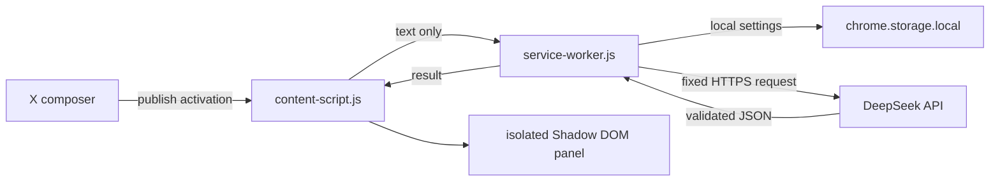

# ClearPost

> Post-submit grammar and spelling feedback for X, powered by DeepSeek.

ClearPost is a dependency-free Manifest V3 extension for Chromium browsers. It watches the publish action for X posts, replies, and quotes, sends only the submitted text for the initial check, and shows a private result panel with either an acknowledgement or correction suggestions. From that result, the user can open a short follow-up conversation that sends an explicit question with the active result context.

**Current version:** `0.2.1`

**Current mode:** check after posting

**Supported platforms:** Chromium-based browsers on Windows and Linux

## What it does

- Captures the active X composer when the publish action is activated.
- Checks grammar and spelling independently.
- Optionally asks DeepSeek for a short acknowledgement of what reads well.
- Preserves the original post, including hashtags, mentions, URLs, emojis, line breaks, and voice.
- Displays a clean-result message or an original-versus-suggested comparison.
- Opens a contextual follow-up conversation for questions and clarifications.
- Formats common Markdown in assistant replies, including lists, emphasis, code, quotes, and safe links.
- Keeps the API key in the extension's local storage and out of the X page.
- Provides opt-in diagnostic logs for request timing and response shape.

ClearPost does **not** edit, delay, delete, or automatically repost anything. The result and follow-up conversation are informational; applying a suggestion remains a deliberate user action in the X composer.

## Quick start

### 1. Get a DeepSeek API key

Create a key in the [DeepSeek platform](https://platform.deepseek.com/). Never commit a key or paste it into source code, an issue, or chat.

### 2. Load the extension

Use the unpacked project folder, or extract the release archive first. Then open your Chromium browser's extension manager:

- Chrome: `chrome://extensions`
- Edge: `edge://extensions`
- Brave: `brave://extensions`
- Other Chromium browsers: their equivalent extensions page

Turn on **Developer mode**, choose **Load unpacked**, and select the project folder:

```text
x-deepseek-proofreader/
```

ClearPost opens its options page after installation. If it does not, select **Details → Extension options** for ClearPost.

### 3. Configure it

1. Paste your own DeepSeek API key into **API key**.
2. Leave `deepseek-v4-flash` selected for lower latency, or choose `deepseek-v4-pro`.
3. Click **Test connection**.
4. Select the checks and response language you want.
5. Click **Save settings**.
6. Reload any X tabs that were already open before the extension was installed or reloaded.

### 4. Try a submission

Submit a post, reply, or quote on `https://x.com`. ClearPost should show:

1. a short **Checking your post…** loading panel;
2. a clean acknowledgement, or an original/suggested comparison; and
3. an **Ask a follow-up** action for questions about the result, plus a dismiss action.

In the follow-up view, ask questions such as “Why is this grammar?” or “Can you make the suggestion warmer?” ClearPost keeps the original text, suggestion, issues, and prior turns in context for that conversation. Nothing is posted or edited automatically.

The request starts when the publish control is activated. It is not confirmation that X's private backend accepted the post; X may still reject a submission afterward.

## Diagnostics

For an error such as `DeepSeek did not return valid JSON`:

1. Open ClearPost settings.
2. Enable **Diagnostics → Debug logging**.
3. Save settings.
4. Open `chrome://extensions` and select **Service worker → Inspect** for ClearPost.
5. Submit one test post and filter the console for `[ClearPost]`.

Useful events include:

```text
[ClearPost] check_started
[ClearPost] api_request_started
[ClearPost] api_response_received
[ClearPost] api_response_shape
[ClearPost] parse_failed
[ClearPost] check_completed
[ClearPost] follow_up_started
[ClearPost] follow_up_completed
```

Debug events include a request ID, model, elapsed time, HTTP status, content length/type, finish reason, and coarse shape flags such as `object_like`, `array_like`, or `markdown_fenced`. They intentionally exclude the API key, submitted post, and full model response. Error summaries remain available even when debug logging is disabled.

## How the extension is structured



| File | Responsibility |
| --- | --- |
| `manifest.json` | Manifest V3 permissions and entry points |
| `content-script.js` | X composer detection, text snapshot, result panel, safe Markdown rendering, follow-up conversation, and dismiss actions |
| `service-worker.js` | Sender validation, settings lookup, timeout, DeepSeek request, safe diagnostics |
| `options.html`, `options.css`, `options.js` | API key, model, checks, language, and diagnostics settings |
| `src/settings.js` | Defaults and settings normalization |
| `src/proofreading.js` | Prompt construction and bounded JSON response parsing |
| `tests/` | Manifest/settings/parser tests and a local X-like visual fixture |
| `docs/` | Architecture, design, privacy, and visual QA notes |

## Permissions and privacy

The extension requests only:

- `storage` to save the API key and preferences locally;
- `https://api.deepseek.com/*` to call the DeepSeek chat endpoint; and
- content-script access on `https://x.com/*` so it can identify the active composer.

It does not request broad browsing access, history, cookies, account data, or media access. Submitted text, follow-up questions, conversation turns, and model results are not stored as a history. `chrome.storage.local` is profile-local but is not an encrypted password vault.

See [PRIVACY.md](PRIVACY.md) for the complete data boundary and [docs/architecture.md](docs/architecture.md) for the trust boundaries.

## Development

There is no build step or dependency installation required for the extension runtime. Node.js is used only for syntax checks and tests.

```sh
npm run check
```

This runs:

- `node --check` for the service worker, content script, and options script;
- the Node test runner for manifest, settings, prompt, and response-parser tests.

### Local visual fixture

The fixture exercises the production content script against a small X-like page without publishing anything:

```sh
python3 -m http.server 8765
```

Open one of these URLs in a browser:

```text
http://127.0.0.1:8765/tests/fixtures/x-compose.html?state=loading
http://127.0.0.1:8765/tests/fixtures/x-compose.html?state=result
```

The fixture stubs the extension message response locally; it does not call DeepSeek.

## Known limitations

- X does not expose a stable public compose-submit API. ClearPost relies on delegated DOM events and X `data-testid` values, so an X UI change may require selector maintenance.
- The listener observes a publish activation, not a server-confirmed post.
- Manifest V3 service workers are event-driven and sleep while idle. “Always on” means active while a matching X tab and the extension are running; it is not a permanent OS daemon.
- DeepSeek/network latency is bounded by a 30-second request timeout.
- Follow-up answers are limited to the active result panel and are not persisted after it is dismissed.
- The `Review before posting` mode is designed in the settings page but is not implemented in `0.2.1`.
- A shared production API key must not be embedded in a distributed extension. Use user-supplied keys or an authenticated backend proxy for multi-user distribution.

## Roadmap

1. Review-before-posting mode with explicit approval.
2. Stronger submit confirmation where X exposes a reliable signal.
3. Additional response-format fallbacks based on diagnostic evidence.
4. Browser-store packaging and a backend credential flow for team use.

## Repository notes

The accepted UI concepts are in `docs/concepts/`. The project is intentionally small and browser-native so it can be loaded unpacked on Windows or Linux without a bundler.
