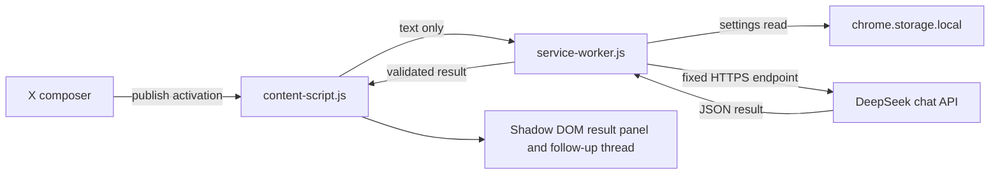

# Architecture

## Trust boundaries

### X page → content script

The page is untrusted. The listener accepts submission activations only from elements whose `data-testid` matches the known X publish controls. Text comes only from a visible composer matching `tweetTextarea_*` and is capped again before the API call.

### Content script → service worker

The service worker verifies that check requests came from this extension on `x.com` or one of its subdomains. The content script cannot choose a network URL, model prompt, authorization header, or API key.

### Service worker → DeepSeek

The destination is constant, HTTPS-only, and also constrained by the manifest host permission. The submitted text is encoded as data inside a JSON user message; the system message explicitly treats it as untrusted text rather than model instructions.

### DeepSeek → page UI

Proofread responses must parse as JSON and are normalized into bounded strings and issue objects. Rendering uses DOM `textContent`/text nodes rather than `innerHTML`, inside a closed Shadow DOM root.

Follow-up answers use the same HTTPS endpoint but a separate plain-text prompt. The active proofread context and bounded prior turns are sent with each question; the service worker validates the request and the content script renders the answer with a small safe Markdown subset using DOM nodes, never `innerHTML`.

## Diagnostics

The service worker emits `[ClearPost]` console events. Debug events are opt-in from settings and are deliberately shape-only: they report request IDs, timing, HTTP status, content length/type, finish reason, and coarse object/array/Markdown-fence classification. They do not report API keys or submitted/model text. Error summaries remain available when debug logging is off so a failed request is not silent.

## Submission detection

X is a single-page React application and does not expose a stable public form-submit hook. ClearPost uses delegated document listeners so newly rendered composers need no observer or polling loop.

- `pointerdown` snapshots the composer before a pointer-driven submit can clear it.
- `click` is the actual activation signal and also covers keyboard button activation.
- A 1.5-second text/time window suppresses duplicate activations.
- The nearest visible composer is preferred, followed by the focused or last-active composer.

This is an activation listener, not confirmation that X's backend accepted the post.

## Non-goals for 0.2.1

- Editing or replacing the X draft automatically.
- Blocking a submission while DeepSeek responds.
- Automatically publishing a corrected post or reply.
- Persisting post text, results, or history.
- Supporting non-X sites.
